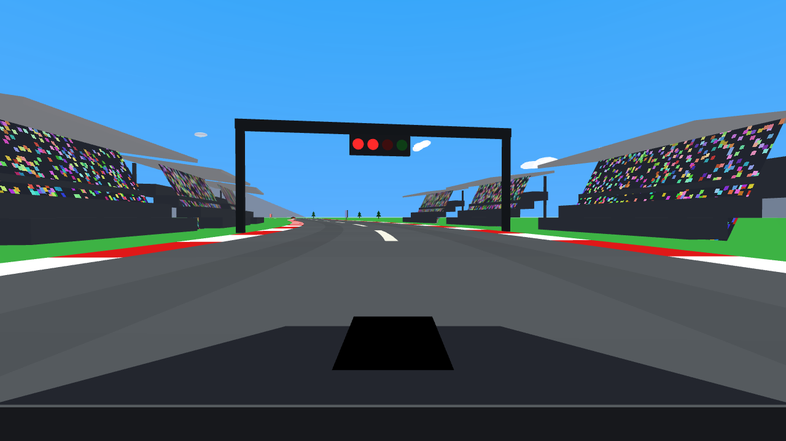

# POLE POSITION

A first-person arcade racer in the spirit of the 1982 classic — built with
[Three.js](https://threejs.org/), no game engine, no art assets: every mesh,
texture, and sound is generated in code.



**[▶ Play it in your browser](https://pniessen.github.io/pole-position/)**

## The game

Beat the clock, dodge rival cars, and keep it on the asphalt. Checkpoints and
laps extend your time; running dry ends the run. Four laps wins the race, and
the top-10 leaderboard (with 3-initial arcade entry) persists between sessions.

- **11 tracks** — 3 originals plus arcade-scale renditions of the Nürburgring
  Nordschleife, Spa-Francorchamps, Monza, Monaco, Indianapolis, Daytona,
  Laguna Seca, and COTA. Each builds its own surroundings: Eifel forest,
  Monte Carlo streets with a harbor, superspeedway grandstand bowls, golden
  Monterey hills, and more.
- **5 cars** with distinct physics and first-person cockpits — black E60 M5,
  black E85 Z4 M, red E46 325xi wagon (AWD: barely slows on grass), a classic
  open-wheel F1 car, and a silver Lotus Elise. Browse them in a 3D showroom
  with stat bars.
- **4-speed gearbox** — each gear caps speed and shapes acceleration; the
  engine note revs through every gear.
- **Arcade furniture** — countdown light gantry, checkered start line,
  crowds that cheer as you pass, billboards, minimap, blimp, birds, clouds.
- **Procedural audio** — engine, skid, crash, checkpoint jingle, and a
  chiptune bass loop, all synthesized with WebAudio.

## Controls

| Key | Action |
| --- | --- |
| ↑ / W | Accelerate |
| ↓ / S | Brake |
| ← → / A D | Steer |
| 1 2 3 4 | Select gear |
| Enter / Space | Confirm menus, start race |
| Esc | Back (menus), change setup (after a race) |

## Run it locally

```bash
npm install
npm run dev
```

```bash
npm test        # 122 unit tests (vitest)
npm run build   # production build to dist/
```

## How it works

The core trick (borrowed from the pseudo-3D racers of the '80s): the car is
not free-roaming physics. Its pose is **(s, x)** — distance along a closed
Catmull-Rom spline plus lateral offset. Handling, traffic AI, collisions, and
lap logic are pure math over that 1.5D space (fully unit-tested), and the 3D
scene is just a projection of it. Steering moves you sideways; corners push
you outward at speed; the grass slows you down.

Track layouts are control-point lists validated by tests for closure, length,
corner count, and — after some hard lessons — geometric self-intersection.

Built almost entirely by [Claude Code](https://claude.com/claude-code).
